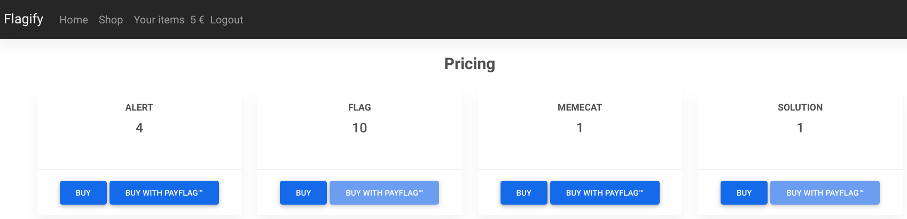
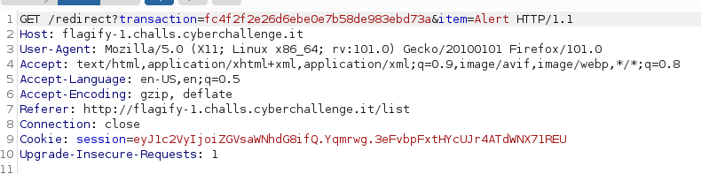
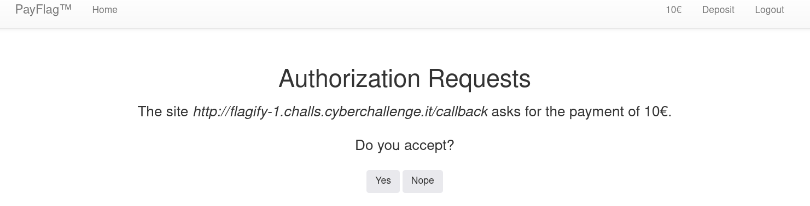

# 🚩 Flagify-1

## Challenge
```
Enjoy another simple shop.

Site: flagify-1.challs.cyberchallenge.it

Site: payflag-1.challs.cyberchallenge.it
```

## Writeup
In this challenge there are two websites. In the first there is a dummy Ecommerce with some articles. The item we need to buy is the *Flag* but it costs 10$ dollars and we only have 5$.



The other website (Payflag) gives us 10$ on Sign up, unfortunately we cannot use this payment method to buy the flag.

The easiest way to solve this challenge is using a *Proxy* to intercept and modify requests. In this writeup I am using *Burp* (but you could also use OWASP ZAP to achieve the same result).

First of all register to both websites and then start intercepting the requests once you are back in the shop page on Flagify (set **Intercept is on** on Burp).
Buy something with *Payflag* (for example the **Alert** item) and go to Burp.
Forward the first two requests:
- The **POST** to ``/list``
- The **GET** to ``/pay?item=Alert``

The third request is the one you need to tamper:



You need to change the item from ``Alert`` to ``Flag`` and then forward the request. After tampering with this request you can also stop intercepting messages and continue from browser.
Then accept the *Authorization Request*



...and enjoy the flag!


**FLAG**: CCIT{g0go_fL4w_go_wr0ng}